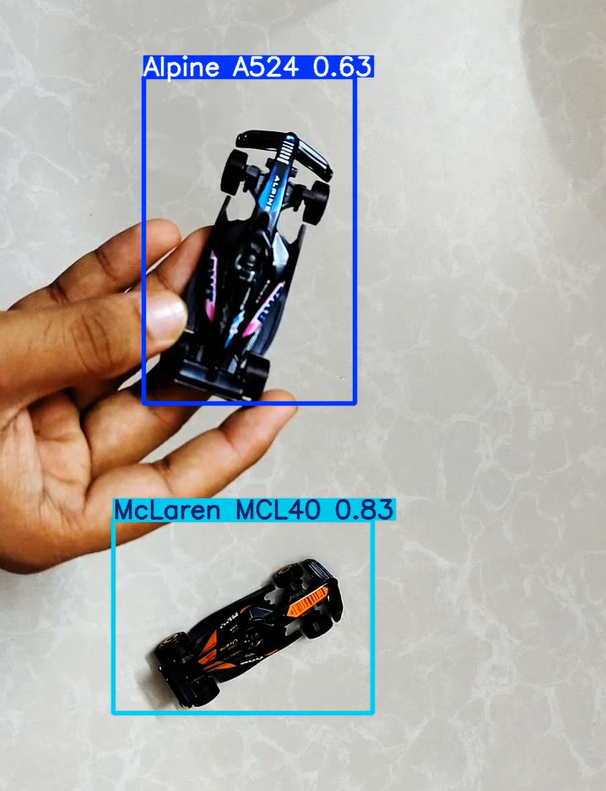

# YOLOv8 F1 Car Detection

Real-time object detection of **Alpine A524** and **McLaren MCL40** Formula 1 cars using a fine-tuned YOLOv8 model.

## Demo

### Inference Result



> The model successfully detects both cars across different angles, distances, and with partial occlusions (including hand interactions).

**Full Result Video:** [Watch / Download](assets/final_test.mp4)

---

## Project Overview

This project demonstrates a complete object detection pipeline using Ultralytics YOLOv8. A custom dataset of two Formula 1 cars was created and labeled, then used to fine-tune the lightweight YOLOv8n model.

**Detected Classes:**
- Alpine A524
- McLaren MCL40

## Results

| Metric       | Value  |
|--------------|--------|
| mAP50        | 0.927  |
| mAP50-95     | 0.491  |
| Precision    | 0.99   |
| Recall       | 0.873  |

The model performs reliably even when the cars are rotated, held by hand, or partially occluded.

## Dataset

- Images collected and labeled using [Roboflow](https://roboflow.com)
- Dataset follows the standard YOLO format
- Train / Validation split used during training

## Training Details

- **Base Model:** `yolov8n.pt`
- **Epochs:** 60
- **Image Size:** 640
- **Batch Size:** 32
- **Platform:** Google Colab
- **Framework:** Ultralytics YOLOv8

## How to Run

### 1. Install Dependencies

```bash
pip install ultralytics
